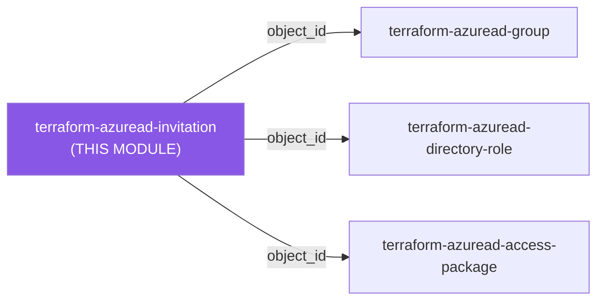
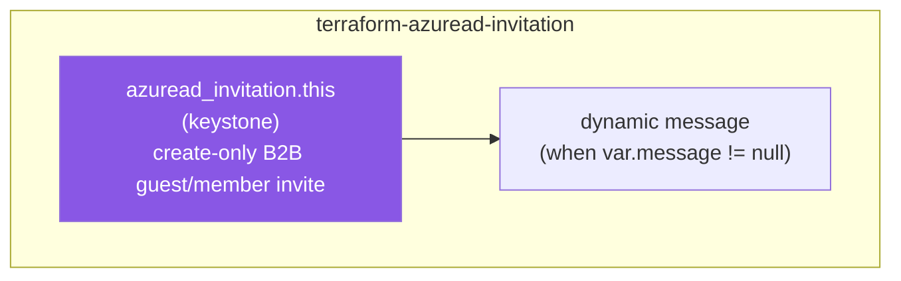

# 📨 Azure AD **Invitation** Terraform Module

> **Invite a single external user into your Entra ID tenant as a B2B guest (or member) — typed `message` schema, https-only redirect, secure `Guest` default, and a `sensitive` one-time `redeem_url`.** Built for azuread **v3.x**.


---

## 🧩 Overview

- 👤 Creates a **B2B guest invitation** (`azuread_invitation`) for one external email address.
- ✉️ Optionally sends a **customized or default invitation email** via a deeply-typed `message` block.
- 🔗 Controls the **post-redemption landing page** through `redirect_url` (https only).
- 🛡️ Defaults the invitee to **`Guest`** — the least-privilege user type for external collaboration.
- 🔐 Emits the **one-time `redeem_url`** as a `sensitive` output so it never leaks into logs or plan diffs.
- 🆔 Surfaces the invited user's directory **`object_id`** for downstream role/group/access-package wiring.

> 💡 **Why it matters:** B2B guest onboarding is the front door for every external partner, auditor, and contractor in the tenant. Standardizing it as code makes invitations reviewable, repeatable, and tied to a redirect target you control — instead of ad-hoc clicks in the portal.

---

## ❤️ Support this project

If these Terraform modules have been helpful to you or your organization, I'd appreciate your support in any of the following ways:

- ⭐ **Star this repository** to help others discover this Terraform module.
- 🤝 **Connect with me on LinkedIn:** [linkedin.com/in/microsoftexpert](https://www.linkedin.com/in/microsoftexpert)
- ☕ **Buy me a coffee:** [buymeacoffee.com/microsoftexpert](https://buymeacoffee.com/microsoftexpert)

Whether it's a star, a professional connection, or a coffee, every gesture helps keep these modules actively maintained and continually improving. Thank you for being part of the community!

---

## 🗺️ Where this fits in the family

This module is an entry-point / identity-creation module — it consumes no other `terraform-azuread-*` module's outputs, only a caller-supplied email address and redirect URL. It sits upstream of every module that grants access to the invited guest: per SCOPE.md, its `object_id` feeds `terraform-azuread-group` (membership), `terraform-azuread-directory-role` (role assignment), and `terraform-azuread-access-package` (entitlements).



This module **consumes** no other module's outputs — it takes only caller-supplied email/redirect configuration; it **emits** `object_id` (the invited user's directory ID), consumed by `terraform-azuread-group`, `terraform-azuread-directory-role`, and `terraform-azuread-access-package` — see the Emits table in [SCOPE.md](./SCOPE.md).

---

## 🧬 What this module builds

A single, create-only resource with two independently-optional dynamic blocks — every argument other than `message`/`timeouts` is a direct passthrough, and the entire resource is immutable once created.



---

## 📁 Module Structure

```
terraform-azuread-invitation/
├── providers.tf # Terraform & azuread provider pins (no provider {} block)
├── variables.tf # Typed inputs: identity refs, user_type, message, timeouts
├── main.tf # Single azuread_invitation.this resource (total renderer)
├── outputs.tf # object_id, user_id, redeem_url (sensitive), passthroughs
├── SCOPE.md # Cross-module contract + Graph API permissions
└── README.md # This file
```

---

## ⚙️ Quick Start

```hcl
module "guest_invite" {
  source = "git::https://github.com/microsoftexpert/terraform-azuread-invitation?ref=v1.0.0"

  user_email_address = "auditor@partner-firm.com"
  redirect_url       = "https://myapps.microsoft.com"
}
```

> ℹ️ Omitting the `message` block means **no invitation email is sent** — you must deliver the `redeem_url` to the invitee yourself over a secure channel.

---

## 🔑 Graph API Permissions Required

The Terraform service principal must hold **one** of the application roles below before `apply` will succeed. `User.Invite.All` is the least-privileged option and is the recommended grant.

| Permission | Type | Required for |
|---|---|---|
| `User.Invite.All` | Application | Creating B2B guest invitations (least-privilege — **recommended**) |
| `User.ReadWrite.All` | Application | Alternative — broader user management incl. invitations |
| `Directory.ReadWrite.All` | Application | Alternative — broad directory write; avoid unless already granted |

> ⚠️ All three are **admin-consent-only** application permissions — a Global Administrator (or Privileged Role Administrator) must grant consent in the tenant. Prefer `User.Invite.All`: it grants exactly the invite capability and nothing more.

> ℹ️ If you authenticate as a **user** rather than a service principal, the equivalent directory roles are **Guest Inviter**, **User Administrator**, or **Global Administrator**. The `Guest Inviter` role lets a principal invite guests even when *"Only users assigned to specific admin roles can invite guest users"* is enforced.

---

## 🔌 Typical wiring

Derived from the SCOPE.md Emits table — the primary cross-module output is `object_id` (the invited user's directory object ID), **not** `id`.

| This module output | Feeds into |
|---|---|
| `object_id` | `terraform-azuread-group` (member `object_id`), `terraform-azuread-directory-role` (principal), `terraform-azuread-access-package` (resource association), role assignments |
| `user_id` | Identical to `object_id` — the raw `azuread_invitation.user_id` attribute |
| `redeem_url` | **`sensitive`** — delivered to the invitee over a secure channel (Key Vault, secure email); never logged |
| `user_email_address` | Audit logs, notification pipelines |

---

## 🧠 Architecture Notes

- **Create-only resource.** `azuread_invitation` exposes no Graph update operation and **cannot be imported**. Every argument is effectively `# IMMUTABLE` — changing `user_email_address`, `redirect_url`, `user_type`, `user_display_name`, or `message` forces Terraform to **destroy and recreate** the invitation, which re-sends a brand-new email and mints a fresh `redeem_url`.
- **`redeem_url` is write-only-grade.** Graph returns the redemption URL only at creation time. It is marked `sensitive = true` so it never appears in console output or plan diffs. To consume it, reference it **only** inside another `sensitive` output or write it straight to Key Vault — never `output` it as a plain string and never echo it in CI logs. Once the guest redeems it, the link is spent.
- **Secure-by-default user type.** `user_type` defaults to `"Guest"`, which receives Entra ID's limited guest directory permissions. `"Member"` grants member-equivalent directory access and can only be set by a Global Administrator — opt in explicitly.
- **`message.body` vs `message.language` are mutually exclusive.** `body` supplies your own message text; `language` only selects the locale of the built-in default message. The module enforces this with a `validation` block, and caps `additional_recipients` at 1 (Azure's documented limit).
- **No credentials, no owners.** Unlike `terraform-azuread-application` / `terraform-azuread-service-principal`, an invitation creates no password or certificate and has no owner collection — so there are no credential outputs to rotate. The only sensitive surface is `redeem_url`.
- **Tenant-scoped.** No `resource_group_name` — invitations live at the directory level.

---

## 📚 Example Library (copy-paste)

<details>
<summary><strong>1 · Minimal</strong> — smallest call that sends no email</summary>

```hcl
module "guest_invite" {
  source = "git::https://github.com/microsoftexpert/terraform-azuread-invitation?ref=v1.0.0"

  user_email_address = "auditor@partner-firm.com"
  redirect_url       = "https://myapps.microsoft.com"
}
```
No `message` block → Entra ID sends **no** invitation email; deliver `redeem_url` yourself.
</details>

<details>
<summary><strong>2 · Send the default invitation email</strong></summary>

```hcl
module "guest_invite" {
  source = "git::https://github.com/microsoftexpert/terraform-azuread-invitation?ref=v1.0.0"

  user_email_address = "auditor@partner-firm.com"
  redirect_url       = "https://myapps.microsoft.com"

  message = {} # empty block → default Entra message in the default locale (en-US)
}
```
</details>

<details>
<summary><strong>3 · Default message in a specific language</strong></summary>

```hcl
module "guest_invite" {
  source = "git::https://github.com/microsoftexpert/terraform-azuread-invitation?ref=v1.0.0"

  user_email_address = "verificateur@cabinet-partenaire.ca"
  redirect_url       = "https://myapps.microsoft.com"

  message = {
    language = "fr-CA" # ISO 639 locale — mutually exclusive with body
  }
}
```
</details>

<details>
<summary><strong>4 · Custom message body</strong></summary>

```hcl
module "guest_invite" {
  source = "git::https://github.com/microsoftexpert/terraform-azuread-invitation?ref=v1.0.0"

  user_email_address = "auditor@partner-firm.com"
  redirect_url       = "https://myapps.microsoft.com"

  message = {
    body = "Welcome to the tenant. This invitation grants you access to the shared audit workspace."
    # NOTE: do not also set language — body and language are mutually exclusive.
  }
}
```
</details>

<details>
<summary><strong>5 · With a display name</strong></summary>

```hcl
module "guest_invite" {
  source = "git::https://github.com/microsoftexpert/terraform-azuread-invitation?ref=v1.0.0"

  user_email_address = "bob.bobson@partner-firm.com"
  user_display_name  = "Bob Bobson (Partner Firm)"
  redirect_url       = "https://myapps.microsoft.com"

  message = {}
}
```
</details>

<details>
<summary><strong>6 · CC an additional recipient</strong></summary>

```hcl
module "guest_invite" {
  source = "git::https://github.com/microsoftexpert/terraform-azuread-invitation?ref=v1.0.0"

  user_email_address = "auditor@partner-firm.com"
  redirect_url       = "https://myapps.microsoft.com"

  message = {
    additional_recipients = ["sponsor@financialpartners.com"] # Azure supports AT MOST 1
    body                  = "You and your sponsor are CC'd on this invitation."
  }
}
```
</details>

<details>
<summary><strong>7 · Invite as a Member (Global Admin only)</strong></summary>

```hcl
module "internal_contractor" {
  source = "git::https://github.com/microsoftexpert/terraform-azuread-invitation?ref=v1.0.0"

  user_email_address = "contractor@vendor.com"
  user_display_name  = "Long-term Contractor"
  redirect_url       = "https://myapps.microsoft.com"
  user_type          = "Member" # member-equivalent access — requires Global Administrator
}
```
> ⚠️ `Member` invitees receive member-level directory visibility. Use only when the external party genuinely operates as internal staff.
</details>

<details>
<summary><strong>8 · Production-ready (-compliant)</strong></summary>

```hcl
module "partner_auditor_invite" {
  source = "git::https://github.com/microsoftexpert/terraform-azuread-invitation?ref=v1.0.0"

  user_email_address = "auditor@external-audit-firm.com"
  user_display_name  = "External Auditor — FY26"
  redirect_url       = "https://myapps.microsoft.com"
  user_type          = "Guest"

  message = {
    body = "You have been invited to the Casey Wood audit collaboration workspace. Please redeem within 7 days."
  }

  timeouts = {
    create = "10m"
  }
}
```
</details>

<details>
<summary><strong>9 · Custom redirect to an internal app</strong></summary>

```hcl
module "guest_invite" {
  source = "git::https://github.com/microsoftexpert/terraform-azuread-invitation?ref=v1.0.0"

  user_email_address = "partner@partner-firm.com"
  redirect_url       = "https://collaboration.financialpartners.com/welcome" # must be https
  message            = {}
}
```
</details>

<details>
<summary><strong>10 · Re-invite (recreate) by changing an immutable field</strong></summary>

```hcl
# Because the resource is create-only, changing redirect_url forces a
# destroy/recreate — Terraform will re-send a fresh invitation and a new
# redeem_url. There is no in-place "resend".
module "guest_invite" {
  source = "git::https://github.com/microsoftexpert/terraform-azuread-invitation?ref=v1.0.0"

  user_email_address = "auditor@partner-firm.com"
  redirect_url       = "https://myapplications.microsoft.com" # changed → recreate
  message            = {}
}
```
> ℹ️ To force a re-invitation deliberately (e.g. the original link expired), use `terraform apply -replace=module.guest_invite.azuread_invitation.this`.
</details>

<details>
<summary><strong>11 · Capture redeem_url into Key Vault (no plaintext exposure)</strong></summary>

```hcl
module "guest_invite" {
  source             = "git::https://github.com/microsoftexpert/terraform-azuread-invitation?ref=v1.0.0"
  user_email_address = "auditor@partner-firm.com"
  redirect_url       = "https://myapps.microsoft.com"
  # message omitted → no email; we hand the link over securely instead
}

resource "azurerm_key_vault_secret" "invite_link" {
  name         = "guest-redeem-url-auditor"
  value        = module.guest_invite.redeem_url # sensitive end-to-end
  key_vault_id = var.key_vault_id
}
```
</details>

<details>
<summary><strong>12 · Cross-module wiring — invite then add to a group</strong></summary>

```hcl
module "guest_invite" {
  source             = "git::https://github.com/microsoftexpert/terraform-azuread-invitation?ref=v1.0.0"
  user_email_address = "auditor@partner-firm.com"
  redirect_url       = "https://myapps.microsoft.com"
  message            = {}
}

module "audit_guests_group" {
  source       = "git::https://github.com/microsoftexpert/terraform-azuread-group?ref=v1.0.0"
  display_name = "External-Audit-Guests"

  members = {
    auditor = module.guest_invite.object_id # invited user's directory object ID
  }
}
```
</details>

<details>
<summary><strong>13 · Bulk invites via for_each</strong></summary>

```hcl
locals {
  partner_emails = {
    auditor1 = "a1@firm-a.com"
    auditor2 = "a2@firm-b.com"
  }
}

module "guest_invites" {
  source   = "git::https://github.com/microsoftexpert/terraform-azuread-invitation?ref=v1.0.0"
  for_each = local.partner_emails

  user_email_address = each.value
  redirect_url       = "https://myapps.microsoft.com"
  message            = {}
}
```
> ℹ️ The module manages **one** invitation; iterate at the call site with `for_each` for bulk onboarding.
</details>

---

## 📦 Inputs (high-level)

<details>
<summary><strong>Full <code>object</code> schemas</strong></summary>

| Variable | Type | Default | Notes |
|---|---|---|---|
| `user_email_address` | `string` | — (required) | Email of the invitee. `# IMMUTABLE`. Validated as an email address. |
| `redirect_url` | `string` | — (required) | Post-redemption landing URL. `# IMMUTABLE`. Must be `https://`. |
| `user_display_name` | `string` | `null` | Display name shown in the directory/email. `# IMMUTABLE`. |
| `user_type` | `string` | `"Guest"` | `Guest` or `Member` (validated). `Member` requires Global Admin. `# IMMUTABLE`. |
| `message` | `object({ additional_recipients = optional(list(string), []), body = optional(string, null), language = optional(string, null) })` | `null` | Omit → no email sent. `body`/`language` mutually exclusive; `additional_recipients` ≤ 1. `# IMMUTABLE`. |
| `timeouts` | `object({ create = optional(string), read = optional(string), delete = optional(string) })` | `{}` | No `update` — resource is create-only. |

```hcl
# message object schema
message = {
  additional_recipients = optional(list(string), []) # at most 1 (Azure limit)
  body                  = optional(string, null)     # custom text; mutually exclusive with language
  language              = optional(string, null)     # ISO 639 locale; mutually exclusive with body
}
```
</details>

---

## 🧾 Outputs

| Output | Description | Sensitive |
|---|---|---|
| `object_id` | Invited user's directory object ID — the universal composition key (alias of `user_id`). | — |
| `user_id` | Raw `azuread_invitation.user_id` attribute. | — |
| `id` | Resource ID of the invitation object. | — |
| `user_email_address` | Email the invitation was sent to. | — |
| `user_display_name` | Display name of the invited user (may be `null`). | — |
| `user_type` | `Guest` or `Member`. | — |
| `redirect_url` | Post-redemption landing URL. | — |
| `redeem_url` | **One-time invitation redemption link.** Write-only — Graph returns it only at creation; re-read is impossible after acceptance. | 🔐 **sensitive** |

---

## 🧱 Design Principles

- **Make the type the contract** — `message` is a deeply-typed `object`; a malformed key fails at plan time, not apply.
- **Secure defaults** — `Guest` user type, https-only redirect.
- **Total renderer** — `main.tf` projects inputs onto provider blocks with `dynamic` blocks and `try(x, null)`; no business logic.
- **Sensitive by default** — `redeem_url` is always `sensitive`; the module never exposes a secret as a plain string.
- **Single resource named `this`** — standalone module, four-file layout, no `provider {}` block.

---

## 🚀 Runbook

```powershell
cd C:\GitHubCode\newazureadmodules\terraform-azuread-invitation
terraform init -backend=false
terraform validate
terraform fmt -check
```

> ℹ️ No `plan`/`apply` here — `azuread_invitation` requires live tenant credentials and a service principal holding `User.Invite.All`. The offline gate (`init -backend=false` + `validate` + `fmt -check`) confirms structural correctness. Test `apply` only against a non-production tenant.

---

## 🔍 Troubleshooting

| Symptom | Cause & Fix |
|---|---|
| **`403 / Insufficient privileges`** on apply | The Terraform SP lacks `User.Invite.All` (or `User.ReadWrite.All` / `Directory.ReadWrite.All`), or admin consent was never granted. Grant `User.Invite.All` and have a Global Admin consent it. |
| **Invitation fails for a specific domain** | Tenant **External collaboration settings** have an allow/block domain list (`Entra ID > External Identities > External collaboration settings`). A blocked domain — or a domain absent from an allow list — rejects the invite regardless of SP permissions. |
| **`Member` user_type rejected** | Only a Global Administrator can invite as `Member`. Use `Guest` or run as a principal with Global Admin. |
| **Email never arrives** | You omitted the `message` block — no email is sent by design. Add `message = {}` for the default email, or deliver `redeem_url` out of band. Also check the invitee's spam filter. |
| **`body and language are mutually exclusive`** | You set both in `message`. Keep one: `body` for custom text, `language` for the default-message locale. |
| **`additional_recipients supports at most 1`** | Azure allows a single CC recipient. Trim the list to one address. |
| **`redirect_url must be a non-empty https:// URL`** | The module rejects http/empty targets by design. Use an https URL (e.g. `https://myapps.microsoft.com`). |
| **Plan wants to destroy/recreate after an edit** | Expected — the resource is create-only. Any attribute change recreates it and issues a fresh invitation + new `redeem_url`. |
| **Can't import an existing invitation** | Unsupported by the provider. Invitations are transient onboarding artifacts; recreate rather than import. |
| **New guest not visible in people pickers / group searches immediately** | Microsoft Graph is eventually consistent — allow ~30–60s of directory replication before referencing `object_id` in a dependent module within the same apply. |

---

## 🔗 Related Docs

- [azuread_invitation resource](https://registry.terraform.io/providers/hashicorp/azuread/latest/docs/resources/invitation)
- [What is Microsoft Entra B2B collaboration?](https://learn.microsoft.com/entra/external-id/what-is-b2b)
- [Configure external collaboration settings](https://learn.microsoft.com/entra/external-id/external-collaboration-settings-configure)
- [Allow or block B2B domains](https://learn.microsoft.com/entra/external-id/allow-deny-list)
- [Guest Inviter built-in role](https://learn.microsoft.com/entra/identity/role-based-access-control/permissions-reference#guest-inviter)

---

> 💙 *"Infrastructure as Code should be standardized, consistent, and secure."*
